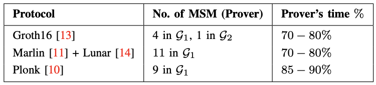
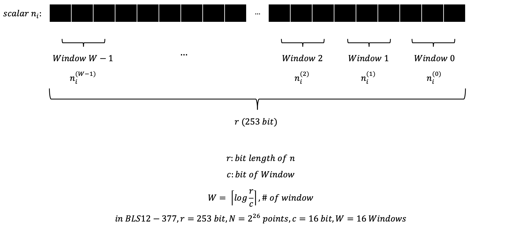
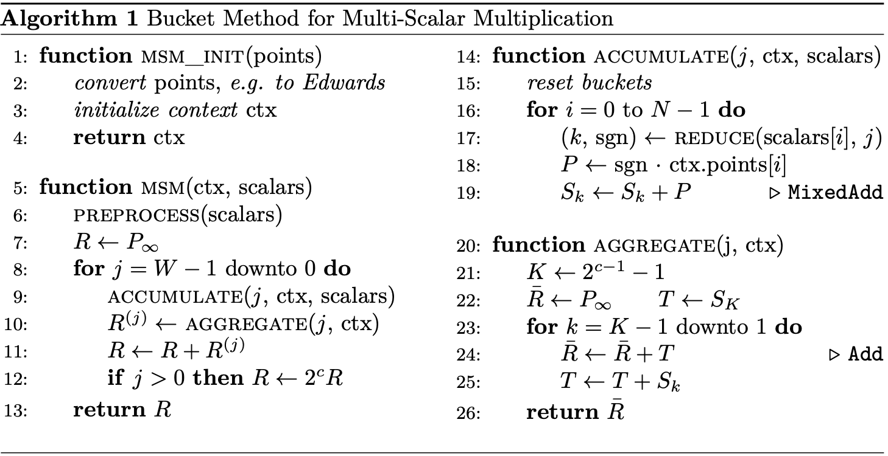

<!-- <figure>
  <a href="https://arxiv.org/pdf/2002.08909" class="bookmark source">
    

      

        
REALM: Retrieval-Augmented Language Model Pre-Training

        
arxiv pdf link for REALM

      

    

  </a>
</figure> -->

## 1. Introduction

$$ R = n_{1}P_{1} + n_{2}P_{2} + \cdots + n_{N}P_{N} = \displaystyle\sum_{i=1}^{N} n_{i}P_{i} $$

위 문제를 MSM (Multi-Scalar Multiplication)이라 한다. $$n$$의 경우 255 bit 정도 되며, $$P$$는 타원쌍곡선 위의 점이다. 또한 반복되는 점들의 개수($$ N $$)는 $$ 2^{20} $$ 정도이다. 이러한 많은 큰 값들을 단순히 컴퓨터의 곱셈 연산 처리 방식을 통해 진행한다고 하면, Overhead가 상당해진다.

위의 표를 확인해보면 여러 Scheme(Protocol)에 대해 Prover의 시간에서 MSM이 차지하는 비율이 70-90%를 차지함을 알 수 있다. 따라서 현재의 ZK-SNARK 과정에서 MSM Acceleration은 무조건 필요하다. 본 논문에서는 해당 가속 연구를 FPGA를 통해 진행하였다.

## 2. Background
### 2.1 Elliptic Curves, Twisted Edwards

 $$ y^{2} = x^{3} + ax + b, \quad \text{with } a, b \in \mathbb{F}_{q} $$ 

위의 Elliptic Curve 식은 **Weierstrass Equation**이다. 곡선은 non-singular하다. 즉, 연속적이며 미분가능하다. 

Elliptic Curve 위의 점들을 다 모은 집합 $$ E(\mathbb{F}_{q}) $$ 중에서, 연산이 잘 정의되며 원소 개수가 소수 $$ r $$인 subgroup을 $$ \mathbb{G} $$라 함.

위의 식을 $$ E $$라 할때, **Twisted Edwards Curve** $$ E^T $$는 아래와 같이 정의된다.

$$ -x^{2} + y^{2} = 1 + \frac{k}{2} x^{2} y^{2}, \quad \text{with } k \in \mathbb{F}_{q}. $$

모든 Twisted Edwards Curve는 Weierstrass Form으로 바꿀 수 있다. 다만, 역은 일부만 성립한다.

**Weierstrass Equation**에서 사용하는 **Coordinates**는 아래와 같다.

- Affine Coordinates: $$ (x, y) $$
- Extended Jacobian Coordinates: $$ (X, Y, Z, W) $$

Elliptic Curves에서 Affine 좌표계를 사용하여 점과 점의 덧셈 연산을 진행할 시, 역원을 구해야 한다. 따라서 그러한 과정이 필요없는 Extended Jacobian 좌표계를 사용한다고 한다. 서로 다른 좌표계의 점들을 더하는 MixedAdd를 진행한다고 하면, Affine 좌표값을 Jacobian으로 형변환 할 때 $$ Z = W = 1 $$로 두어 계산한다고 한다.

**Tiwsted Edwards Equation**에서 사용하는 **Coordinates**는 아래와 같다.

- Exted Affine Coordinates: $$ (x, y, u) $$
- Extended Projective Coordinates: $$ (X, Y, Z, T) $$

Twisted Edwards Form은 $$ k $$라는 값이 정의되어 있다. 따라서 $$ k $$를 이용해 Extended Affine에서 $$ u = kxy$$로 둔다. Extended Jacobian Coordinates와 마찬가지로, Extended Projective Coordinates 역시 역원 계산을 피하기 위한 용도이다.

### 2.2 Bucket Algorithm (Pippenger Algorithm)
Bucket Algorithm은 Pippenger Algorithm 이라고도 불리운다. Nicholas Pippenger가 1976년 제안한 알고리즘으로, 대부분의 MSM Acceleration 연구들에서 사용하고 있는 알고리즘이다.

원리는 하나다. 스칼라를 작은 비트로 쪼개는 것이다.

$$ R = \sum_{i=0}^{N-1} n_{i} P_{i} \in \mathbb{G} $$

위 식에서 $$ n_i $$를 작은 스칼라 값인 $$ \bar{n_i} $$로 쪼갠다. 그렇다면 아래와 같은 식으로 만들어진다.

$$ \sum_{i=0}^{N-1} \bar{n}_{i} P_{i} = \bar{R} $$

쪼개진 스칼라 $$ \bar{n_i} $$를 Reduced Scalar라고 부르며, 위의 식을 **Reduced MSM** 이라고 부른다.

$$ R = \sum_{i=0}^{N-1} n_{i} P_{i} = \sum_{i=0}^{N-1} \left( \sum_{j=0}^{W-1} n_{i}^{(j)} 2^{jc} \right) P_{i}$$

$$ \bar{R} = \sum_{i=0}^{N-1} n_{i}^{(j)} P_{i} $$

즉, 매우 큰 스칼라와 매우 큰 점들을 수없이 곱하고 더하는 것은 곱셈 연산의 측면에서 매우 비효율적이기에, Scalar를 먼저 쪼개는 방법이라고 이해하면 된다. 이 과정만 거친다고 해서 효율적이게 변하지는 않고, 아래의 과정이 필요하다.

먼저 각각의 scalar 값들을 bucket으로 만든다.

$$ \textit{bucket } B_{k}, \quad B_{k} = \{ P_{i} \mid \bar{n}_{i} = k \} $$

예를 들어, $$ n_3P_3 $$에서, reduced scalr가 아래와 같다 하자.

$$ n_3^0 = 13 $$

$$ n_3^1 = 5 $$

$$ n_3^2 = 0 $$

$$ n_3^3 = 21 $$

그렇다면 $$ P_3 $$는 $$ \mathcal{B}_{13}, \; \mathcal{B}_{5}, \; \mathcal{B}_{21} $$에 들어가지게 된다. 만약 모든 점들에 대해 Bucket에 넣는 과정이 끝나게 된다면, 각각의 Bucket안에 있는 값들을 더하기 위해 $$ S_k $$를 정의할 수 있다.

$$ S_{k} = \sum_{P \in \mathcal{B}_{k}} P $$

그렇다면 MSM 문제는 아래와 같이 재정의 가능하며, Bucket 0은 즉 reduced scalar가 0인 값이기에 굳이 계산에 넣지 않아도 된다.

$$ \sum_{i=0}^{N-1} n_{i} P_{i} 
= \sum_{k=0}^{2^{c}-1} k S_{k} 
= \sum_{k=1}^{2^{c}-1} k S_{k} $$

또한, 마지막 식의 경우 아래와 같이 누적합을 통해 더욱 가속시킬 수 있다.

$$ \sum_{k=1}^{T} k S_{k} = S_{T} + (S_{T} + S_{T-1}) + \cdots + (S_{T} + S_{T-1} + \cdots + S_{1}). $$

Scalar $$ n_i $$를 Reduced Scalar로 쪼개는 과정을 만들어보았다. 임의의 비트만큼을 잡아서 쪼갤 수 있으며, 그때 만들어진 Reduced Scalar를 Window라 한다.

$$ R^{(j)} 
= \sum_{i=0}^{N-1} n_{i}^{(j)} P_{i} 
= \sum_{k=0}^{2^{c}-1} k S_{k},
\quad \text{where } S_{k} = \sum_{P \in \mathcal{B}_{k}} P $$

$$ R = \sum_{j=0}^{B-1} 2^{jc} R^{(j)} $$

위의 수식처럼 임의의 Reduced Scalar $$ R^{(j)} $$를 구했다 한들, 원래 있던 비트 위치만큼 왼쪽으로 shift 해주어야 한다.

## 3. CycloneMSM

논문에 나와있는 Pseudo Code를 통해 Algorithm을 간접적으로 이해해보자.